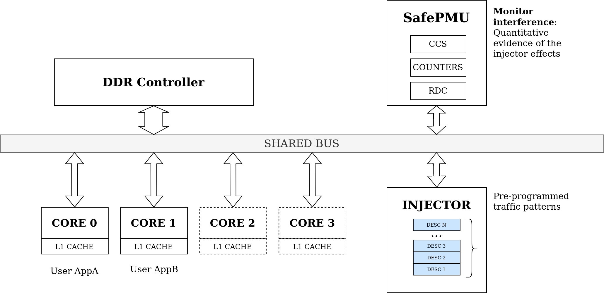
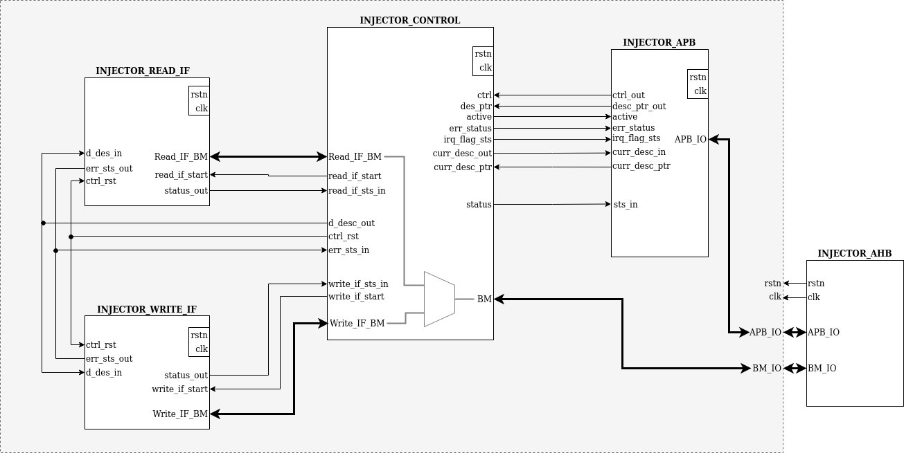
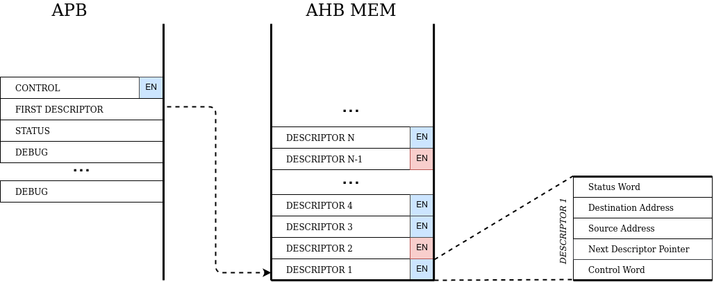

# Traffic Injector 
The Safe Traffic Injector (SafeTI for short) unit acts as an AHB Master IP connected to the main AMBA bus. It acts as a core with limited capabilities, only generating transactions to the bus by reading and writing to the AHB Slave RAM memory and controlled via APB registers. The injector works along with the multi-core setup instantiated on the platform and other peripherals and monitoring units. In order to generate traffic to the bus, the module performs a set of AMBA transactions based on data descriptors set at startup into a predefined memory address range.

## Description
This unit acts as an AHB Master IP connected to the main AMBA bus on the SELENE Platform. It acts as a core with limited capabilities, only generating transactions to the bus by reading and writing to the AHB Slave RAM memory and controlled via APB registers.
The injector works along with the multi-core setup instantiated on the platform and other peripherals and monitoring units.
In order to generate traffic to the bus, the module performs a set of AMBA transactions based on data descriptors set at startup into a predefined memory address range.
A high-level block diagram of the module is shown, its internal components and respective configuration and functionalities are described





Please find more information inside the ```docs``` directory.

## Descriptors
Descriptors are used to define, control, and monitor transactions in the Traffic Injector. Descriptor types supported by this module can be classified, as of today, as read and write descriptors. Furthermore, each transaction type has the possibility of starting a **burst transfer** by **not fixing** the Source and Destinations bits in the **Descriptor Control Word**.



For more informatio regarding the use of the Module, see [Specifications](docs/Injector_Specs.pdf)


## Reference

If you are using the SafeTI IP for an academic publication, please cite the following paper:

O. Sala et al., "SafeTI: a Hardware Traffic Injector for MPSoC Functional and Timing Validation," 2021 IEEE 27th International Symposium on On-Line Testing and Robust System Design (IOLTS), 2021, pp. 1-7, doi: 10.1109/IOLTS52814.2021.9486689.

```
@INPROCEEDINGS{9486689,
  author={Sala, Oriol and Alcaide, Sergi and Cabo, Guillem and Bas, Francisco and Lorenzo, Ruben and Benedicte, Pedro and Trilla, David and Gil, Guillermo and Mazzocchetti, Fabio and Abella, Jaume},
  booktitle={2021 IEEE 27th International Symposium on On-Line Testing and Robust System Design (IOLTS)}, 
  title={SafeTI: a Hardware Traffic Injector for MPSoC Functional and Timing Validation}, 
  year={2021},
  volume={},
  number={},
  pages={1-7},
  doi={10.1109/IOLTS52814.2021.9486689}}
```

