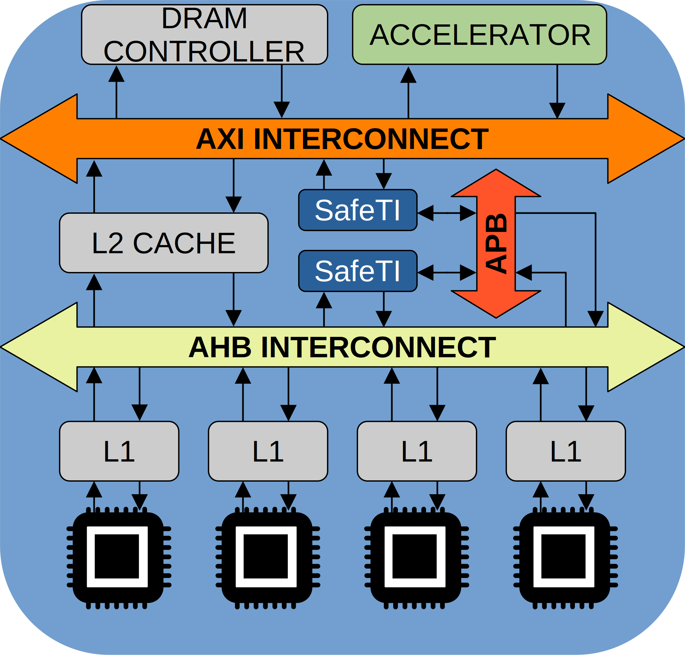

# Safe Traffic Injector
The Safe Traffic Injector (SafeTI for short) unit acts as an AHB or AXI4 Manager IP connected to the main AMBA bus. It functions as a core with limited capabilities, only generating transactions to the bus by reading and writing to memory address and controlled via APB registers. The injector works along with the multi-core setup instantiated on the platform and other peripherals and monitoring units. In order to generate traffic to the bus, the module must be first programmed with a series of descriptors describing the traffic pattern to be injected. Then, once the SafeTI module is configured and enabled, it performs a set of AMBA transactions based on the programmed data descriptors into a predefined memory address range.

## Description
The core components of the SafeTI IP are designed in VHDL without any external dependencies, allowing implementation at other platform provided a compatible interface to the target interconnect. In this matter, the SafeTI has been integrated on an instance of the SELENE platform at both AHB and AXI4 networks. Component wrappers that can be used as templates are presented within the ```hdl/platform_wrappers``` directory, where the ```injector_core``` is instanced with a platform's AHB interface or a custom AXI4 interface on their respective implementation cases.
A high-level block diagram of the module is shown, its internal components and respective configuration and functionalities are described.

<div align="center">
  <br>
  SafeTI integration example on an AHB and AXI interconnects. <br><br>
   <br>
  SafeTI pipeline architecture and core components. <br><br>
</div>

Please find more information inside the ```docs``` directory.

## Descriptors
Descriptors are used to define, control, and monitor transactions generated by the Traffic Injector. Descriptor types supported by this module can be classified, as of today, as read, write and delay descriptors. Furthermore, each transaction type has unique programmable **size**, **number of iterative executions**, among other parameters for describing the access pattern to generate.

These descriptors are programmed, by 32-bit word steps and in execution order, through the **Descriptor Input Feed** register from the APB subordinate allocation, which are transmitted to be stored at the internal **Descriptor Buffer**. These will be fetched, decoded and executed through the 3-stage pipeline once the SafeTI module is enabled and configured at the **Control Register**.

These operations are supported for bare-metal execution by the included drivers from the ```sw``` directory, which include commentaries with instructions. For more information regarding the use of the Module, see [Specifications](docs/Injector_Specs/SafeTI_manual.pdf) [Document WIP].


## Reference

If you are using the SafeTI IP for an academic publication, please cite the following paper:

F. Fuentes et al., "Black-Box IP Validation with the SafeTI Traffic Injector: A Success Story," 2023 IEEE International Symposium on Defect and Fault Tolerance in VLSI and Nanotechnology Systems (DFT), Juan-Les-Pins, France, 2023, pp. 1-4, doi: 10.1109/DFT59622.2023.10313565.

```
@INPROCEEDINGS{10313565,
  author={Fuentes, Francisco and Alcaide, Sergi and Casanova, Raimon and Abella, Jaume},
  booktitle={2023 IEEE International Symposium on Defect and Fault Tolerance in VLSI and Nanotechnology Systems (DFT)},
  title={Black-Box IP Validation with the SafeTI Traffic Injector: A Success Story},
  year={2023},
  volume={},
  number={},
  pages={1-4},
  doi={10.1109/DFT59622.2023.10313565}}
```

## Related publications

F. Fuentes et al., "On-chip Traffic Injection to Counteract Timing Side-Channel Attacks". ERTS2024, Jun 2024, Labège, Toulouse, France. pp.197-208. ⟨hal-04614786⟩.

@inproceedings{fuentes:hal-04614786,
  TITLE = {{On-chip Traffic Injection to Counteract Timing Side-Channel Attacks}},
  AUTHOR = {Fuentes, Francisco and Alcaide, Sergi and Casanova, Raimon and Abella, Jaume},
  URL = {https://hal.science/hal-04614786},
  BOOKTITLE = {{ERTS2024}},
  ADDRESS = {Lab{\`e}ge, Toulouse, France},
  EDITOR = {Mohamed Kaaniche and Kevin Delmas and Christophe Grand and Eric Jenn and Christine Rochange},
  PUBLISHER = {{Philippe Cuenot}},
  PAGES = {197-208},
  YEAR = {2024},
  MONTH = Jun,
  KEYWORDS = {Cyber security ; MPSoC ; Side-channel attack mitigation ; AES encryption},
  PDF = {https://hal.science/hal-04614786/file/main.pdf},
  HAL_ID = {hal-04614786},
  HAL_VERSION = {v1},
}


O. Sala et al., "SafeTI: a Hardware Traffic Injector for MPSoC Functional and Timing Validation," 2021 IEEE 27th International Symposium on On-Line Testing and Robust System Design (IOLTS), 2021, pp. 1-7, doi: 10.1109/IOLTS52814.2021.9486689.

```
@INPROCEEDINGS{9486689,
  author={Sala, Oriol and Alcaide, Sergi and Cabo, Guillem and Bas, Francisco and Lorenzo, Ruben and Benedicte, Pedro and Trilla, David and Gil, Guillermo and Mazzocchetti, Fabio and Abella, Jaume},
  booktitle={2021 IEEE 27th International Symposium on On-Line Testing and Robust System Design (IOLTS)},
  title={SafeTI: a Hardware Traffic Injector for MPSoC Functional and Timing Validation},
  year={2021},
  volume={},
  number={},
  pages={1-7},
  doi={10.1109/IOLTS52814.2021.9486689}}
